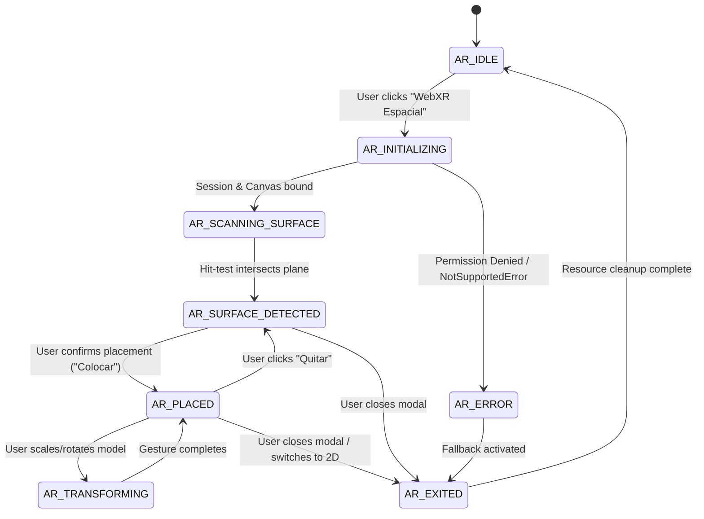

# WebXR AR Spatial Session Lifecycle & State Machine Guide
## AI Operating Platform Portfolio — PROJ-01-TENTACIONES

============================================================
CANONICAL DOCUMENT: docs/AR_SESSION_GUIDE.md
STATUS: CERTIFIED
PROJECT: PROJ-01-TENTACIONES
RELEASE: v1.4.0 (Phase 88 Certified)
STATE MACHINE: Formal 9-State Discrete Lifecycle
CLEANUP POLICY: Zero Memory Leak / Single Active Session Lock
============================================================

## 1. Formal AR State Machine Transitions

---

## 2. Resource Cleanup Guarantee

To prevent GPU memory leaks and duplicate render loops during repeated opens and closes:

* `cancelAnimationFrame(state.arSpatial.animFrameId)` is executed immediately upon session termination.
* `clearTimeout(state.arSpatial.isScanningSim)` prevents lingering state mutations.
* `session.end()` cleanly disposes of the underlying XR hardware device handle.
* All state values (`surfaceHit`, `placedObject`, `transform`) reset monotonically to default boundaries.
